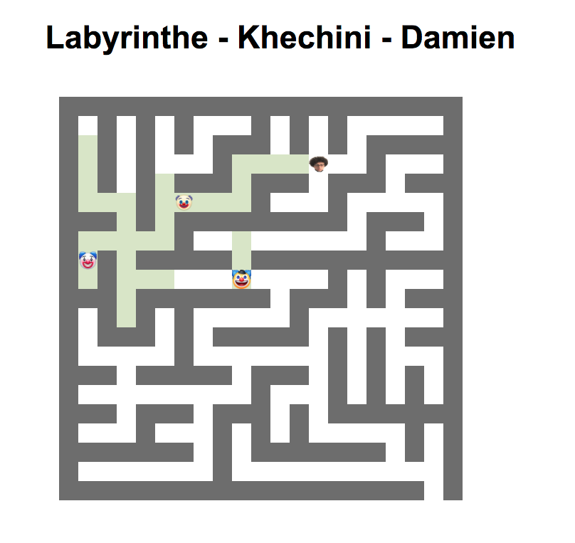

# Le Projet Labyrinthe - Khechini - Damien

Le but du jeu est de traverser un labyrinthe avec des ennemis. Chacun des ennemis possèdent un champ de vision différent contrairement au joueur qui voit toute la carte.
Le but étant de sortir du labyrinthe sans être vu par les ennemis.
Il existe alors 3 types d'ennemis : 
- Celui avec des déplacements aléatoires mais qui voit sur une courte distance
- Un autre avec des déplacements droits mais qui change de direction à chaque fois qu'il tombe sur un mur. Il a un champ de vision normal
- Et enfin, un ennemi ayant un paterne et avec un champ de vision important.
Pour augmenter la difficulté, il est possible de rendre certaines cases plus lente que les autres : Par exemple : De la boue ou de l'eau qui réduirait la vitesse du joueur
